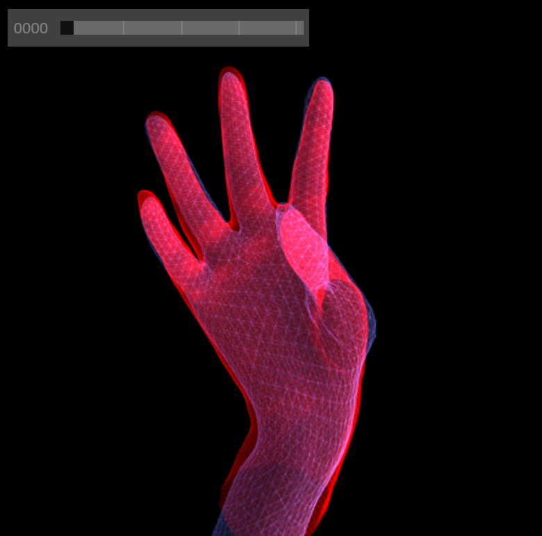
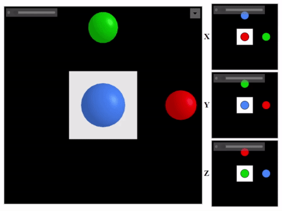

# ScenePic

&copy; Microsoft 2020

Primary Contact: <matjoh@microsoft.com>

[API Documentation](http://aka.ms/svtdocs)

## License
ScenePic is (for now) a Microsoft internal tool only, and without proper CELA
review, results should not be shipped or shared externally.  For example, to
minimize library size, several open source dependencies are pulled in
by `npm install` and then minified into a single output file
"dist/svt.min.js" which removes license information.

The C++ client library uses four open source components:
- [`jsoncpp`](https://github.com/open-source-parsers/jsoncpp), a lightweight
  C++ JSON encoder/decoder component.
- [`cpp-base64`](https://github.com/ReneNyffenegger/cpp-base64), a standalone
  base64 encoder/decoder component.
- [`tinyobjloader`](https://github.com/tinyobjloader/tinyobjloader), a standalone
  Wavefront OBJ loader component.
- [`miniz-cpp`](https://github.com/tfussell/miniz-cpp), a standalone compression library.

All four are appropriately notified and imported in the codebase.

## Introduction

All platforms have good support for 2D images, with well-recognized formats
such as PNG and JPEG that can be viewed out of the box (no installation)
and shared trivially.

However, while many formats exist for 3D data, none are well-supported
without installation of tools such as MeshLab, Blender, etc.
Windows is at the beginning of a journey to fixing that with Windows
Mixed Reality and Paint 3D, but it is still early days.

SVT (Science Visualization Toolkit) was created for 3D computer vision
researchers such as those in Analog (Science).  SVT was designed as a
lightweight, reuseable 3D visualization library, with the following
desiderata in mind:
- Make experimentation with 3D data near effortless
- Incredibly easy to create and share 3D results
  - zero-install sharing of detailed 3D results using HTML
  - based on modern web standards so usable with any modern browser
    (tested in Edge and Chrome)
  - embeddable in other HTML documents
- Performant
  - based on WebGL
- High quality visuals
- Works both offline or interactively in client-server setup
- Simple, clean API
  - friendly Python front-end
  - basic mesh json file format
  - other language front ends easy to add
- Extensible to WebVR in future
  - use HoloLens in our science workflow

An example render:



Here is an animation of the Getting Started tutorial (
  [Python](https://microsoft.visualstudio.com/Analog/_git/analog.science.SVT?path=%2Fexamples%2Fgetting_started.py)
  [C++](https://microsoft.visualstudio.com/Analog/_git/analog.science.SVT?path=%2Fcppsrc%2Fexamples%2Fgetting_started.cpp)
):




## Overview

The core SVT library is written in TypeScript and based on WebGL.  This 
is compiled down to `dist/svt.min.js` which is a 'minified' JavaScript
library that can be loaded in HTML pages to enable SVT to display data.

The core API for SVT is a JSON-based scripting file format.  The
simplified architecture diagram below illustrates how these scripts
are used to define a *Scene* which is the top-level object in SVT.
A *Scene* can contain multiple *Canvas*es (3D drawing canvases),
*Image*s, and *TextPanel*s.  Each *Canvas* can contain multiple
*Frame*s.  *Frame*s comprise multiple *Mesh*es, and *Mesh*es can
be reused across different *Frame*s and *Canvas*es.  *Mesh*es are
basically triangle meshes, comprising flat vertex and triangle
buffers.  Each *Mesh* has an optional *Image* associated for texturing
purposes.  *Image*s can also be displayed as flat 2D *Displayed Image*s.


However, most users will not need interact with SVT's core API and
scripting language directly.  Instead they will use one of the
client-language front end libraries to easily generate SVT JSON
scripts.  Currently supported are:

### C++
Users can either clone this repository and
[build the client library](#c-client-build-how-to)
directly, or download one of the [pre-built binaries](https://svtdocs.azurewebsites.net/svt/binaries/)

### Python
As the Python interface is provided via a wrapper around the C++
interface, Users can clone the repository and follow most of the
instructions to [build the c++ client library](#c-client-build-how-to),
but then run
```
python setup.py develop
```
which will then build and install the SVT Python wheel.
Alternatively, pre-built wheels are available [here](https://microsoft.visualstudio.com/Analog/_packaging?_a=feed&feed=mraipackages)

## Expected Usage

The master branch of the SVT git repository will be kept up-to-date
with the latest version. We will also provide binary builds of
the latest version for the C++ and Python client interfaces. We
highly recommend, where possible, using the binary builds we provide.

### Getting Started with Python

Please follow the instructions above to either create a custom build
of the library or, preferably, to install one of our pre-built
binary wheels.

For a quick tutorial, take a look at [`getting_started.py`](examples/getting_started.py).

For a more extensive tutorial, install Python and Jupyter, and open the
`examples/Python Tutorial/SVT-Python-Tutorial.ipynb` notebook.
This tutorial also demonstrates the use of SVT within the interactive
Jupyter notebook environment.

A similar example is given in `examples/Hello World Example/Hello World.ipynb`.

Note: you may need to set the `NotebookApp.iopub_data_rate_limit` setting in
jupyter to prevent an IOPub error.  To do this, call
`jupyter notebook --generate-config` to generate a config file, and then edit
the appropriate line to increase the value until it works.

We provide a website with full Python API documentation [here](https://svtdocs.azurewebsites.net/svt/python/index.html)

### Getting started with C++

To see an example of how to use the library from C++ look at 
[the example code](https://microsoft.visualstudio.com/Analog/_git/analog.science.SVT?path=%2Fcppsrc%2Fexamples).
You can find the API documentation [here](https://svtdocs.azurewebsites.net/svt/cpp/index.html)

## Using the HTML Client


An SVT HTML page will look something like the image above.  This example shows
two *Canvas*es, each of which contains several *Frame*s (refering under the
hood to a set of *Mesh*es).

The UI supports standard 3D mouse controls (drag to rotate, shift-drag to
translate in xy, mousewheel to translate in z) to move the viewport camera.
On touch screens: single finger to rotate, two fingers to translate in xyz.
You can slow any of the mouse controls by holding down the Alt key. If you
accidentally transform the camera too wildly, you can reset by pressing 'r'.

In the top right of each canvas a *Layer* control will appear (when
programmatically enabled via `svt.py/Canvas/set_layer_visibilities()`).
This allows the user to toggle certain layers of meshes on and off
interactively. 

Each *Frame* has an associated *Focus Point* - a 3D location about which
the camera rotates.  You can view the *Focus Point* by holding down the
'`' (backtick) key, and while holding this down it can be translated using
the mouse.  If you press 'l' then the camera is 'locked' to the focus
point in xy, though you can still rotate and translate in z.  Locking to
the focus point is particularly useful to center useful content in
animations where the focus point can be different in each frame. You
can also toggle the camera automatically orbiting the focus point by
pressing '\\'.

For *Scene*s that contain many frames, you can control animation by
pressing the spacebar to play/pause.  You can also use the scrollbar
to select different frames.

You can globally toggle wireframe using 'w' and transparency using 't'.

You can programmatically link all input events across multiple
*Canvas*es by using `svt.py/Scene/link_canvas_events()`.

## Client-server mode

Another way to use SVT is in a 'client-server mode'.  In this case
the HTML front-end webpage will connect to a specified server
(can be <http://localhost/>).  The server can emit SVT commands
to the HTML client, and keypresses in the HTML client will be
reported back to the server.

For an example, see `examples/Interactive Example/svt_interactive.py`.


## Building SVT core library from source

The core library portion of SVT is written in TypeScript which needs
compiling to JavaScript.

### Pre-requisites (install in order)

- Node.js (JavaScript outside the browser)
   > <https://nodejs.org/>

- TypeScript compiler
    > `npm install -g typescript`

- Install node_module dependencies locally (these don't get checked in to git)
    
    From repository root folder:
    > `npm install`

    As specified in package.json, this downloads and installs packages 
    locally under `node_modules` folder.
    
    (This folder should not be checked in and is .gitignored).


### Build

Run commands from root folder.  Builds output to the `dist` folder. 

- Build all: compiles the typescript, packages all dependencies, and minifies.
    > `npm run build`

## C++ Client Build How-To

In order to build the C++ client from source you will need to first install a
few dependencies:

### Doxygen (optional)

If you want to build the documentation, you will need to download and install
Doxygen. On Windows, you can use the `prepare_deps.py` script to do this:

```
cd libs
python prepare_deps.py
```

If you are on Ubuntu and want to build the documentation, you should run:

```
sudo apt-get install doxygen
```

(or equivalent, e.g. `brew install doxygen` on Mac) to install the Doxygen
documentation creation tool.

### CMake

The C++ build makes use of the CMake cross-platform build system. You can find
instructions on how to set up CMake for your platform [here](https://cmake.org/).
CMake is a meta-build system, which will create a platform-appropriate build
setup based upon the files which we have provided in the project (_e.g._ makefiles
for *nix, Visual Studio project files for Windows). We require a minimum version
of 3.8. We also require a C++ 14 compliant toolchain. One CMake is installed
you should navigate to the cloned repository and run the following commands:

```
mkdir build
cd build
cmake ..
cmake --build . --config Debug --target svt_tests
```

CMake will attempt to find the dependencies on your system, and will tell
you if it is unable to find something, in which case you can manually
point it at the correct location. You may find it easier to use a visual
CMake configuration editor (CMake GUI ships with the Windows distributable,
and there is CMake Curses for *nix) to customize the build, for example
by disabling the documentation or Python build subsystems. Once you have
successfully built the library, you can run the tests in the following fashion
from the build directory:

```
ctest -C Debug
```
