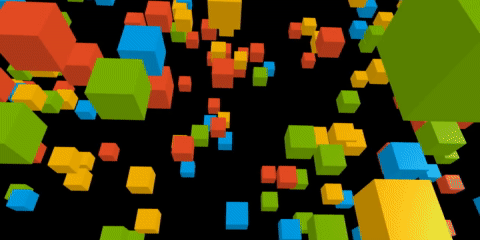
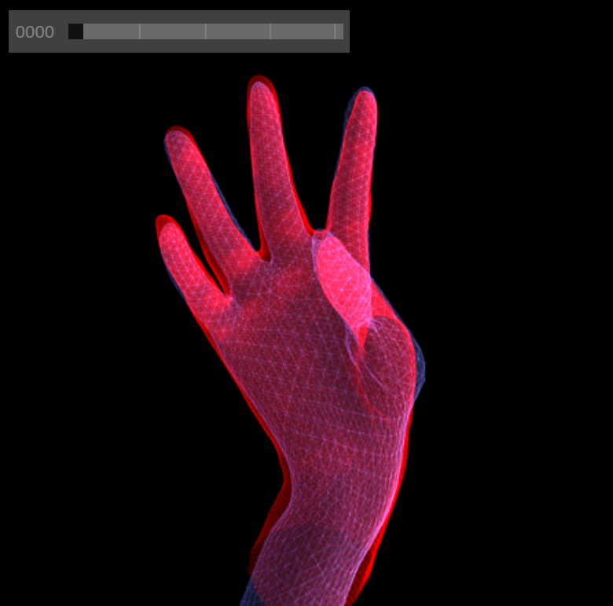
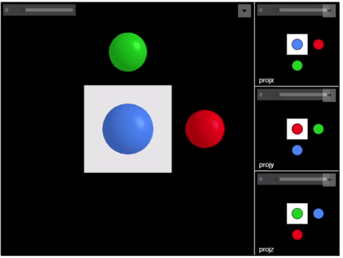
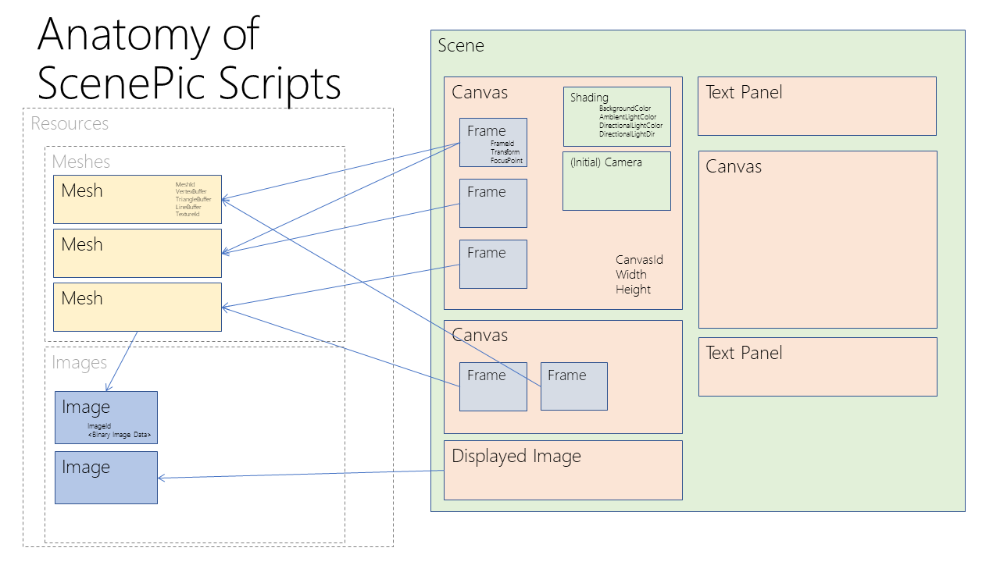
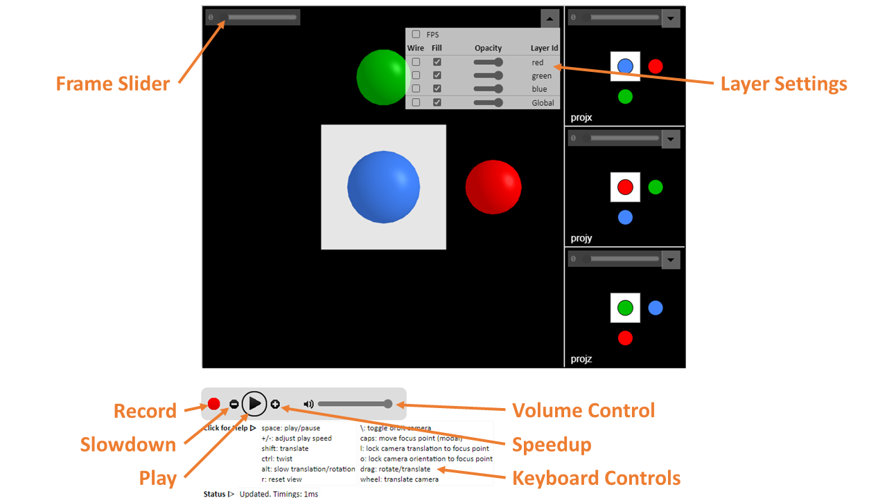

 [](https://microsoft.github.io/scenepic/zoo/hello_scenepic.html)

&copy; Microsoft 2021

Primary Contact: <scenepic@microsoft.com>

[](https://microsoft.visualstudio.com/Analog/_build/latest?definitionId=74916&branchName=main)

## Getting Started

To look at some examples and browse the documentation, visit our
website:

[API Documentation + Demos](https://microsoft.github.io/scenepic/)

We currently support Python and C++:

### Python
We provide up-to-date Python wheels via
[PyPi](https://pypi.org/project/scenepic/):

```
pip install scenepic
```

If you want to build the library yourself (e.g. for development reasons)
can clone the repository and follow most of the instructions
to [build the c++ client library](#c-client-build-how-to),
but then run
```
python setup.py develop
```
which will then build and install the library locally.

For a quick tutorial, take a look at
[`getting_started.py`](https://github.com/microsoft/scenepic/blob/main/python_examples/getting_started.py).

For a more extensive tutorial, install Python and Jupyter, and open the
`python_examples/tutorial.ipynb` notebook.
This tutorial also demonstrates the use of ScenePic within the interactive
Jupyter notebook environment.

A similar example is given in `python_examples/getting_started.ipynb`.

Note: you may need to set the `NotebookApp.iopub_data_rate_limit` setting in
jupyter to prevent an IOPub error.  To do this, call
`jupyter notebook --generate-config` to generate a config file, and then edit
the appropriate line to increase the value until it works.

We provide a website with full Python API documentation [here](https://microsoft.github.io/scenepic/python/)

### C++
ScenePic is fully compatible with 
[CMake FetchContent](https://cmake.org/cmake/help/latest/module/FetchContent.html),
and we encourage users to include the library in their projects via that
mechanism. Alternatively, you can follow the instructions below to
[build the client library](#c-client-build-how-to) directly.

To see examples of how to use the library from C++ look at 
[the tutorial](https://github.com/microsoft/scenepic/blob/main/src/examples/tutorial.cpp).
You can find the API documentation [here](https://microsoft.github.io/scenepic/cpp)

## Introduction

All platforms have good support for 2D images, with well-recognized formats
such as PNG and JPEG that can be viewed out of the box (no installation)
and shared trivially.

However, while many formats exist for 3D data, none are well-supported
without installation of tools such as MeshLab, Blender, etc.

ScenePic was created for 3D computer vision researchers such as those
working on [HoloLens](https://www.microsoft.com/en-gb/hololens)
and [Mesh](https://www.microsoft.com/en-us/mesh) at Microsoft.
It was designed to be a lightweight, reuseable 3D visualization
library, with the following desiderata in mind:

- Make experimentation with 3D data near effortless
- Incredibly easy to create and share 3D results
  * zero-install sharing of detailed 3D results using HTML
  * based on modern web standards so usable with any modern browser
    (tested in Edge, FireFox and Chrome)
  * embeddable in other HTML documents
- Performant
  * based on WebGL
- High quality visuals
- Works both offline or interactively in client-server setup
- Simple, clean API
  * friendly Python front-end
  * basic mesh json file format
  * other language front ends easy to add

An example render:



Here is an animation of the Getting Started tutorial (
  [Python](https://github.com/microsoft/scenepic/blob/main/python_examples/getting_started.py)
  [C++](https://github.com/microsoft/scenepic/blob/main/src/examples/getting_started.cpp)
):




## Architecture

The core ScenePic library is written in TypeScript and based on WebGL.  This 
is compiled down to `dist/scenepic.min.js` which is a 'minified' JavaScript
library that can be loaded in HTML pages to enable ScenePic to display data.

The core API for ScenePic is a JSON-based scripting file format.  The
simplified architecture diagram below illustrates how these scripts
are used to define a *Scene* which is the top-level object in ScenePic.
A *Scene* can contain multiple *Canvas*es (3D drawing canvases),
*Image*s, and *TextPanel*s.  Each *Canvas* can contain multiple
*Frame*s.  *Frame*s comprise multiple *Mesh*es, and *Mesh*es can
be reused across different *Frame*s and *Canvas*es.  *Mesh*es are
basically triangle meshes, comprising flat vertex and triangle
buffers.  Each *Mesh* has an optional *Image* associated for texturing
purposes.  *Image*s can also be displayed as flat 2D *Displayed Image*s.



However, most users will not need interact with ScenePic's core API and
scripting language directly.  Instead they will use one of the
client-language front end libraries to easily generate ScenePic JSON
scripts.  Currently supported are C++ and Python.

## Expected Usage

The main branch of the ScenePic git repository will be kept up-to-date
with the latest version. We highly recommend, where possible, using the
binary builds we provide. That said, the library is FetchContent compatible,
and can be easily included into C++ projects where desired.

## Using the HTML Client



A ScenePic HTML page will look something like the image above. This example shows
four *Canvas* objects, each of which contains several *Frame* objects (referring under the
hood to a set of *Mesh* objects).

The UI supports standard 3D mouse controls (drag to rotate, shift-drag to
translate in xy, mousewheel to translate in z) to move the viewport camera.
On touch screens: single finger to rotate, two fingers to translate in xyz.
You can slow any of the mouse controls by holding down the Alt key. If you
accidentally transform the camera too wildly, you can reset by pressing 'r'.

In the top right of each canvas a *Layer* control will appear.
This allows the user to toggle certain layers of meshes on and off
interactively.

Each *Frame* for a 3D canvas has an associated *Focus Point* - a 3D
location about which the camera rotates.  You can view the *Focus Point* by
holding down the '``' (backtick) key, and while holding this down it can be
translated using the mouse.  If you press 'l' then the camera is 'locked' to the focus
point in xy, though you can still rotate and translate in z.  Locking to
the focus point is particularly useful to center useful content in
animations where the focus point can be different in each frame. You
can also toggle the camera automatically orbiting the focus point by
pressing '\\'.

For *Scene* objects that contain many frames, you can control animation by
pressing the spacebar to play/pause or by using the playback control
widget.  You can also use the scrollbar to select different frames.

You can programmatically link all input events across multiple
*Canvas*es by using `scenepic.py/Scene/link_canvas_events()`.

## Building ScenePic core library from source

The core library portion of ScenePic is written in TypeScript which needs
compiling to JavaScript.

### Pre-requisites (install in order)

- Node.js (JavaScript outside the browser)
   > <https://nodejs.org/>

- Install node_module dependencies locally
    
    From repository root folder:
    > `npm install`

### Build

Run commands from root folder.  Builds output to the `dist` folder. 

- Build: compiles the typescript, packages all dependencies, and minifies.
    > `npm run build`

## C++ Client Build How-To

In order to build the C++ client from source you will need to first install a
few dependencies:

### Doxygen (optional)

If you want to build the documentation, you will need to download and install
Doxygen. You can download and install the latest version of doxygen
[here](https://www.doxygen.nl/download.html)

If you are on Ubuntu and want to build the documentation, you should run:

```
sudo apt-get install doxygen
```

(or equivalent, e.g. `brew install doxygen` on Mac) to install the Doxygen
documentation creation tool.

### CMake

The C++ build makes use of the CMake cross-platform build system. You can find
instructions on how to set up CMake for your platform [here](https://cmake.org/).
CMake is a meta-build system, which will create a platform-appropriate build
setup based upon the files which we have provided in the project (_e.g._ makefiles
for *nix, Visual Studio project files for Windows). We require a minimum version
of 3.15. We also require a C++ 14 compliant toolchain. One CMake is installed
you should navigate to the cloned repository and run the following commands:

```
mkdir build
cd build
cmake ..
cmake --build . --config Debug --target cpp
```

CMake will attempt to find the dependencies on your system, and will tell
you if it is unable to find something, in which case you can manually
point it at the correct location. You may find it easier to use a visual
CMake configuration editor (CMake GUI ships with the Windows distributable,
and there is CMake Curses for *nix) to customize the build, for example
by disabling the documentation or Python build subsystems. 

To run tests, set the cmake option `SCENEPIC_BUILD_TESTS=ON` when building and 
run the test command once you have successfully built the library, in the following
fashion from the build directory:
```
ctest -C Debug
```

## Contributing

This project welcomes contributions and suggestions.  Most contributions require you to agree to a
Contributor License Agreement (CLA) declaring that you have the right to, and actually do, grant us
the rights to use your contribution. For details, visit https://cla.opensource.microsoft.com.

When you submit a pull request, a CLA bot will automatically determine whether you need to provide
a CLA and decorate the PR appropriately (e.g., status check, comment). Simply follow the instructions
provided by the bot. You will only need to do this once across all repos using our CLA.

This project has adopted the [Microsoft Open Source Code of Conduct](https://opensource.microsoft.com/codeofconduct/).
For more information see the [Code of Conduct FAQ](https://opensource.microsoft.com/codeofconduct/faq/) or
contact [opencode@microsoft.com](mailto:opencode@microsoft.com) with any additional questions or comments.

## Trademarks

This project may contain trademarks or logos for projects, products, or services. Authorized use of Microsoft 
trademarks or logos is subject to and must follow 
[Microsoft's Trademark & Brand Guidelines](https://www.microsoft.com/en-us/legal/intellectualproperty/trademarks/usage/general).
Use of Microsoft trademarks or logos in modified versions of this project must not cause confusion or imply Microsoft sponsorship.
Any use of third-party trademarks or logos are subject to those third-party's policies.
